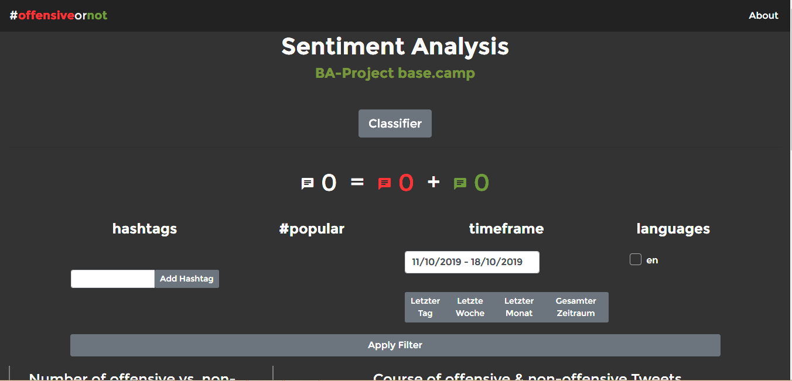
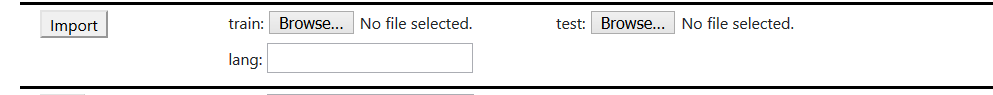

# Sentiment19

This project contains a prototype for a web application based on the Spring Boot framework. Machine Learning has been implemented using the dl4j-framework.

A vue.js-based frontend allows users to query a database of twitter data with respect to the offensive-/non-offensive character of tweets. The respective statistics are visualized by a variety of graphs.   

This spring-boot app offers two APIs:

- a frontend API which delivers the html/js and includes Endpoints, which allow the client to get statistical data from the database and a visualisation of random tweets satisfying the specified criteria.  
- a secured backend API allowing registered Users to initiate imports, change application settings, upload files and train the machine learning components.

We recommend to [view this file on Github](https://github.com/pawap/sentiment19/blob/develop/README.md), to take full advantage of all markdown-features:

written by Pawel Rasch

---
### How to run the app
You can run the app from your IDE (tested with intellij and eclipse), deploy it as a war under a tomcat-server or run it with maven. 
Bear in mind that this app uses the dl4j-framework in a way which demands quite a lot of resources. The following system requirements are just a hint. Depending on the way you use the app, you might probabely need a lot more or maybe a little less.   

---
#### System requirements

##### Hardware:
- modern multi-core cpu
- at least 6GB of free Memory
- at least 6GB of free discspace 

##### Software:
- JAVA 11 
- apache tomcat 9
- apache maven
- mongodb

---
#### Setup

##### Prerequisites
1. You will need a running mongodb-instance.

   See the [offcial docs](https://docs.mongodb.com/manual/installation/) for instructions.
 By default your mongodb will run under localhost:27017

2. Clone this repository with git:
 
   ```git clone https://github.com/pawap/sentiment19.git```

   (Alternatively just download it and copy it into the desired folder)

3. copy either [application.properties.local](src/main/resources/application.properties.local) or [application.properties.deploy](src/main/resources/application.properties.deploy) in the [/src/main/resources directory](src/main/resources) (depending on whether you want to run it locally or deploy it on a server) and save it as ```application.properties``` in the same folder.

4. Configure your db-connection in the new file:

   ```
   spring.data.mongodb.database=<db>
   spring.data.mongodb.host=<host>
   spring.data.mongodb.port=<port>
   spring.data.mongodb.uri=mongodb://<host>:<port>/<db>
   ```
   The configuration data is redundant, you only need the first three lines, or the last one. 
If you don't have a db just yet, don't worry! Spring Boot will create a db by the specified name, if one does not exist.

5. Optionally configure a custom port for the web app to run (default is 8080):

   ```server.port=8080```

##### Run it with intellij
<a name="Run-it-with-intellij"></a>
1. Open the project as a maven-project.
   See the [official docs](https://www.jetbrains.com/help/idea/maven-support.html#maven_import_project_start) for help  

2. Run [Application.java](src/main/java/sentiments/Application.java).
 
   Intellij should automatically import all necessary maven-sources and build the maven project after that.
   You may need to change the classpath-settings in the run-configurations if your system does not support long commands from the command-line.
     
3. You're done! The App should be running now, even though there is no data in there just yet.

   Verify that everything is fine - so far - by navigating your favorite browser to <http://localhost:8080/sentiment19> 
 
   It should look something likes this:
   
   

##### Build a .war for deployment 

1. Open with intellij. [See previous section.](Run-it-with-intellij)  

2. Edit [Application.java](src/main/java/sentiments/Application.java) and make this class extend SpringBootServletInitializer:

   Before:
   ```java
   public class Application {
   ```
   After:
   ```java
   public class Application extends SpringBootServletInitializer {
   ``` 

3. Edit [pom.xml](pom.xml) and mark the tomcat dependency, which comes with spring boot as provided by uncommenting the following lines:

   ```
   <!--        <dependency>-->
   <!--            <groupId>org.springframework.boot</groupId>-->
   <!--            <artifactId>spring-boot-starter-tomcat</artifactId>-->
   <!--            <scope>provided</scope>-->
   <!--        </dependency>-->
   ```
   
4. Build the .war file by selecting 'Build Artifacts' from the 'Build' menu. See [offical docs](https://www.jetbrains.com/help/idea/working-with-artifacts.html) for support.   

##### Run with maven

[Install maven](https://maven.apache.org/install.html) first, if you don't have it yet. 

1. Edit [pom.xml](pom.xml) and change the packaging from war to jar:
   ```xml
   <packaging>war</packaging>
   ```   
   &rarr; 
   ```xml
   <packaging>jar</packaging>
   ```
   (If you want a .war file leave the packaging-entry alone.)

2. Build with maven:
   ```bash
   mvn compile
   mvn package
   ```
3. Run the jar.

You may have to configure classpath settings and the like. Take a look at the [official docs](https://maven.apache.org/index.html).

---
---
### Local development vs. running the app on a server 

#### Context-Path
The original app was deployed at: <http://basecamp-demos.informatik.uni-hamburg.de:8080/sentiment19/>.
If you wish to deploy the app at another path, you will have to edit all relative urls in the following files:
- [sentiment-frontend.html](src/main/resources/frontend/sentiment-frontend.html)
- [sentiment-backend.html](src/main/resources/frontend/sentiment-backend.html)
The local context path is set to "/sentiment19" to have the same paths on the server and locally.
Therefore, all Endpoints have the structure ```§baseUrl/sentiment19/...```, where
```$baseUrl``` will be ```localhost:8080/``` or ```basecamp-demmos.inf...```  

The base-url/path will be fully configurable in a future release.

#### Storage
Our storage-system is not fully developed. Some assets (like serialized neural-nets) are stored with an absolute path on the server, some others (like serialized wordvectors) are stored relative to the classpath. A future release will contain a unified aproach to data storage in the filesystem. You will have to tweak path a little bit, depending on whether you are developing locally or running on a server.

---
---
### Backend-Security
All Endpoints starting with ```sentiment19/backend/``` are protected by password.
Create a collection named 'user' in the mongodb and insert a document with the following structure:
```json
{
  'username': <user> , 
  'password': <pass>
}
```
(The document will have to have an '_id' field, of course.) The password <pass> needs to be encoded with bcrypt. Here's a useful [web-based bcrypt encoder](https://www.browserling.com/tools/bcrypt).

Now you can access the backend with your configured credentials.

---
---
### Data Import

Sadly, the data import is a little tricky to configure.

#### Basic Data Import

The basic import features language-detection. If you wish to set the language manually, you can do so after importing or by changing the code inside the [ImportTweetPreProcessor](src/main/java/sentiments/domain/preprocessor/ImportTweetPreProcessor.java).  

1. You need an unpacked text file (UTF-8 !!!) containing one json object per line. Each json objects represents one tweet.
 
   Each Json-Object must contain the following keys:
   - `full_text` or `text`: The text of the tweet.
   - `id_str` : twitterID of the tweet
   - `created_at`: Date of the tweet. We support almost any format.

2. Put the file into the directory configured in application.properties:

    ```
    localTweetJson = <path-to-json>/<filename>
    ```
    
    Don't forget to configure the correct filename.
    
3. Call the endpoint "sentiment19/backend/import" (via browser or curl or any way you like)

4. Your local db (collection "tweet") should be filled with a bunch of tweets.
   You can test it by either running the server and sending a request to: "localhost:8080/sentiment19/count" or by 
   opening the mongo shell and using the commands `use <dbname>` followed by `db.tweet.count()`

Please note, that the language detection takes quite a bit of time. Import rates of 300-900 Tweets per second are a realistic assumption, at the moment. 
#### Import labeled test and training data

This is comfortably possible via our backend. You will need .tsv files for this, though.

1. Your files should have the following columns and a header containig these column names:

   - `tweet` 
   
      contains the text of the tweet, and
   - `subtask_a`
   
      contains the label: Starting with `OFF` for offensive and anything else for non-offensive.

2. Open the backend in a modern browser (we don't support IE). 
   Use the provided import-section:
   
   

3. Enter the iso-Code [(ISO 639-1)](https://en.wikipedia.org/wiki/List_of_ISO_639-1_codes) of the language the labeled tweets are in.

4. Select files containing test and training data, respectively. 

   (You can import both at once or just one of them)

5. Click the import-Button. Tweets should be imported into the collection "trainingTweet".

### Languages

We support all languages availble for detection by the [pemistahl/lingua](https://github.com/pemistahl/lingua) library, here's a [list](https://github.com/pemistahl/lingua#supported-languages). 
For each language there have to be two trained models available:

- Wordvectors
- Classifier 

Luckily, those can be trained in the App, if labeled data is available. 

#### Preconfigured Languages
English and German are already preconfigured programmatically. 
You should find two entries in the Collection 'language' with ISO-Codes 'en' and 'de'.

#### Active Languages
Active Languages are available for training AND displayed in the frontend. 
This will be decoupled in future releases. 

Both preconfigured languages are marked as not active. 
The corresponding entry in the collection has the key `active` set to `false`.
To activate a language just update the document, setting `active` set to `true`.

#### Add Languages
Insert a new Document of the following form into the language collection:
```json
{
  "_id":"5d873af671dc941840efb481",
  "iso":"en",
  "name":"en",
  "classifierFilename":"resources/classifier_en.nn",
  "wordVectorsFilename":"resources/word2vec_en.bin",
  "active":true,
  "_class":"sentiments.domain.model.Language"
}
```
`ìso` has to be in [(ISO 639-1)](https://en.wikipedia.org/wiki/List_of_ISO_639-1_codes) format.

---
---
### Train/acquire Models

You can now train models for all active languages. As mentioned before, the app uses 
two different models per language.
Before tweets can be classified as offensive or non-offensive, wordvectors have to be
available in order to vectorize the raw textinput.

Pretrained models are only available for English, so far.

#### Wordvectors
Wordvectors need a large amount of training data.
Fortunately, it doesn't have to be labeled. 

##### Storage
The models are typically quite big (~ 1.5GB) The path to the wordvectors for 
a specific language is stored in the corresponding entry in the language collection, 
under the key ```wordVectorsFilename```.
You have to specify either the absolute path or a path relative to the working directory 
of your app. 

##### Training

###### Data needed:

You need a lot (>10m) of imported tweets in the tweet collection. Training data (trainigTweet collection) is NOT used. 

###### Initiate traning
The model can be trained by calling the following GET endpoint:

`/sentiment19/backend/ml/w2vtraining?lang=<iso>`

where `<iso>` has to be substituted with the iso-Code of an active language.

#### Classifier
The only available classifier in the newest release (apart from a dummy class) is the [W2VTweetClassifier](src/main/java/sentiments/ml/classifier/W2VTweetClassifier.java).

##### Storage
The models are typically small (< 10MB) compared to the wordvectors. 
The path to a classifier for a specific language is stored in the 
corresponding entry in the language collection, under the key ```classifierFilename```.
You have to specify either the absolute path or a path relative to the working directory 
of your app. 

##### Training
###### Data needed:

You need labeled data imported into the trainigTweet collection under the right language key. 
The data has to have a ratio of offensive to nonoffensive tweets, which is very near to 1:2.
Otherwise, training will be unbalanced, with detrimental effects to the accuracy of the
classifier.

###### Initiate training
The model can be trained by calling the following GET endpoint:

`/sentiment19/backend/ml/trainnet?lang=<iso>`

where `<iso>` has to be substituted with the iso-Code of an active language.

### Classifying the data
Once the trained models are available for a language, the corresponding data can be classified.
There is a task available for classification. On every startup of the app all tasks are disabled,
so you have to activate it via the web-backend:


Enter 'classify' and check the enable-box. Click the send-Button.

### Performance issues
The data-layer will have to be completely reworked in a future release. Currently the 
aggregation-queries extracting the data for the timeline and the popular hashtags 
features in the frontend are painfully slow. They're taking at least 50-90 seconds for the 
database operations alone on a database of ~50m Tweets (XXXGB). 

### Logging
Logs are written to the console by default. Logging target is configured in the [logback-spring.xml](src/main/resources/logback-spring.xml)
you can uncomment all commented lines to enable file-logging. Logging-level and login-file can be adjusted in the ```application.properties```.

### Mongo-Fake-Data
You can tweak the imported data for testing purposes:
Go to the [src/main/resources/mongoscripts](src/main/resources/mongoscripts) directory and run the following commands (replacing `<DBNAME>` with the name of your local DB):
````
mongo MongoDates.js --eval 'var dbName="<DBNAME>";'
mongo mongo MongoFakeLabels.js --eval 'var dbName="<DBNAME>";'
````
(alternatively just run those scripts with mongo from anywhere. Warning may not work out of the box with Authorization on the DB)
- first one assigns new, nicely distributed dates to all tweets
- second one labels 1/3 of all tweets as offensive

Other scripts available:
- [MongoClearClassified.js](src/main/resources/mongoscripts/MongoClearClassified.js)
   
  Labels all tweets in the tweet collection as not classified. 
- [MongoSetAllClassified.js](src/main/resources/mongoscripts/MongoSetAllClassified.js)

  Labels all tweets in the tweet collection as currently classified.  
- [MongoSetupDateFields.js](src/main/resources/mongoscripts/MongoSetupDateFields.js)

   Extracts year, month, an day values from the crdate-timestamp into separate fields. At the moment this script has to be run after every import, before tweets can be included in the statistics concerning the timeline, which go out to the frontend. 
   This was caused by a recent futile struggle to improve performance.

### Coming Up

- optimization of data-layer
- better storage management
- configurable data import-Api
- languages and tasks fully configurable in the web-backend
- improved web-backend interface
- advanced model-managment
- more
   
